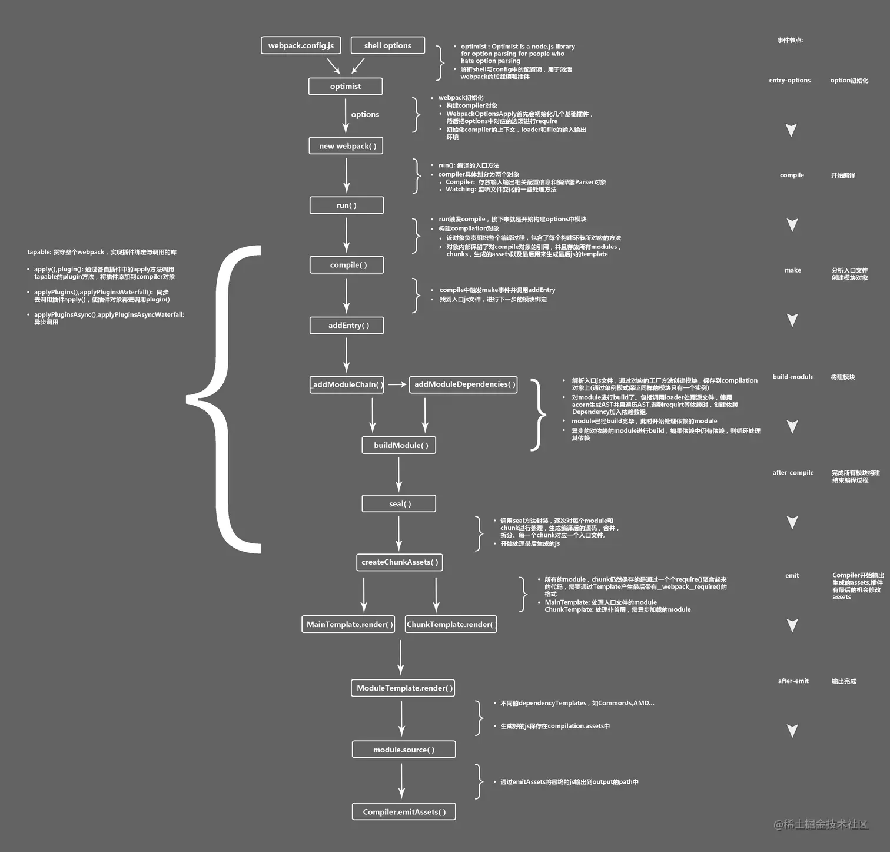

# mini-webpack

简易的 webpack



## 实现流程

这个 mini-webpack 的工作原理是通过`Compiler`类来协调整个构建流程，从入口模块开始递归处理所有依赖模块，最终生成可执行的 bundle 文件<cite/>。

### 入口模块处理机制

入口模块的处理从`webpack.config.js`中的`entry`配置开始。当执行`compiler.run()`方法时，系统会获取入口文件路径并将其转换为相对路径格式 。

### 核心工作流程

#### 1. 初始化阶段

系统从`bin/webpack.js`启动，创建`Compiler`实例并注册插件。

```js
//webpack.js
const Compiler = require("../lib/Compiler");

const config = require("../webpack.config");

const createCompiler = () => {
  const compiler = new Compiler(config);

  if (Array.isArray(config.plugins)) {
    for (const plugin of config.plugins) {
      plugin.apply(compiler);
    }
  }
  return compiler;
};
const compiler = createCompiler();
compiler.run();
```

```js
//Compiler.js
const { SyncHook } = require("tapable");
class Compiler {
  constructor(options) {
    this.options = options;
    this.hooks = {
      initialize: new SyncHook(), // 初始化完成
      run: new SyncHook(), // 开始编译
      compile: new SyncHook(), // 开始编译模块
      buildModule: new SyncHook(["modulePath"]), // 编译单个模块
      emit: new SyncHook(), // 生成资源
      afterEmit: new SyncHook(), // 写入文件完成
      done: new SyncHook(), // 打包完成
      watchRun: new SyncHook(), //监听
      afterCompile: new SyncHook(),
    };
    this.modules = {};
    this.root = process.cwd(); // 确保 root 被正确设置

    this.extensions = this.options.resolve?.extensions || [".js", ".json"]; // 设置默认扩展名

    this.fileTimestamps = new Map(); // 记录文件修改时间，以便实现文件监听的效果
    this.watcher = null; // 文件监视器

    console.log("extensions", this.extensions);
    console.log(
      "simple-webpack ------------------> 实例化 Compiler",
      this.root
    );
    this.hooks.initialize.call(); // 触发初始化钩子
  }
}
```

这里执行初始化逻辑以及注册钩子等 其他插件在**特定时期**调用

#### 2. 模块构建流程

**buildModule 方法是处理每个模块的核心逻辑**
入口模块通过`buildModule(entry, true)`开始处理 。每个模块的处理包括：
这个方法执行以下关键步骤：

- 将模块路径统一处理为相对路径
- 处理循环依赖问题
- 读取模块源码并通过 loader 处理 读取模块源码并通过 loader 处理
- 解析模块的依赖关系
- 递归构建所有依赖模块

```js
buildModule(modulePath, isEntry) {
  // 统一处理为相对路径
  modulePath =
    "./" + path.relative(this.root, modulePath).replace(/\\/g, "/");
  // 补全文件名
  modulePath = this.resolveModulePath(modulePath);

  // 循环依赖处理：如果模块已在处理中，返回其部分导出
  if (this.modules[modulePath] === "processing") {
    // 返回一个空对象作为临时占位符
    // 返回一个空对象作为临时占位符函数
    this.modules[modulePath] =
      "(function(module, exports, __webpack_require__) { module.exports = {}; })";
    return;
  }

  if (this.modules[modulePath]) {
    return; // 解决循环依赖问题
  }

  // 标记模块为"处理中"
  this.modules[modulePath] = "processing";

  this.hooks.buildModule.call(modulePath);
  const source = this.getSource(modulePath);

  const { sourceCode, dependencies } = this.parse(source, modulePath);
  this.modules[modulePath] = sourceCode;
  console.log(
    "simple-webpack ------------------> 解析模块",
    modulePath,
    dependencies
  );

  dependencies.forEach((d) => {
    const dependencyPath = path.resolve(this.root, d);
    this.buildModule(dependencyPath, false); // 递归构建依赖
  });
}
```

#### 3. 源码解析与依赖分析

parse 方法使用 Babel AST 来分析和转换模块代码
这个过程中会：

- 将源码中的 require 调用替换为**webpack_require**
- 解析并收集所有的依赖模块路径
- 将相对路径转换为绝对路径，然后再转回相对路径以确保一致性

```js
// 根据模块的源码进行解析
parse(source, moduleName) {
  let dependencies = [];
  const dirname = path.dirname(moduleName);
  const requirePlugin = {
    visitor: {
      // 替换源码中的require为__webpack_require__
      CallExpression: (p) => {
        const node = p.node;
        if (node.callee.name === "require") {
          node.callee.name = "__webpack_require__";
          // 路径替换
          let modulePath = node.arguments[0].value;
          // 基于当前模块路径解析相对路径
          if (modulePath.startsWith("./") || modulePath.startsWith("../")) {
            modulePath = path.resolve(dirname, modulePath);
            // 转换为相对路径
            modulePath =
              "./" + path.relative(this.root, modulePath).replace(/\\/g, "/");
          } else {
            // 对于绝对路径或模块名，保持原有逻辑
            modulePath =
              "./" + path.relative(this.root, modulePath).replace(/\\/g, "/");
          }
          modulePath = this.resolveModulePath(modulePath);
          // 补全文件名
          node.arguments = [t.stringLiteral(modulePath)];
          dependencies.push(modulePath);
        }
      },
    },
  };
  let result = babel.transform(source, {
    plugins: [requirePlugin],
  });
  return {
    sourceCode: result.code,
    dependencies,
  };
}
```

#### 4. Loader 处理

getSource 方法负责通过各种 loader 处理模块内容

```js
getSource(modulePath) {
  //getSource是为了获取模块的原始内容，同时让其他loader起作用
  let content = fs.readFileSync(modulePath, "utf-8");
  const rules = this.options.module.rules;

  for (const rule of rules) {
    const { test, use } = rule;
    if (test.test(modulePath)) {
      // 匹配上了
      let length = use.length - 1;
      const loopLoader = () => {
        // 使用箭头函数
        const { loader, options } = use[length--];
        let loaderFunc = require(loader); // loader是一个函数

        // 手动绑定 Loader 上下文
        const loaderContext = {
          resourcePath: modulePath, // 设置 resourcePath
          options: this.options, // 传递 Webpack 配置
        };

        // 调用 Loader，并绑定上下文
        content = loaderFunc.call(loaderContext, content, options);

        if (length >= 0) {
          loopLoader();
        }
      };
      if (length >= 0) {
        //启动
        loopLoader();
      }
    }
  }
  return content;
}
```

它会根据配置的 rules 匹配文件类型，然后按顺序应用相应的 loader。

### 最终输出

编译完成后，使用 EJS 模板生成最终的 bundle 文件
这个模板创建了一个类似 webpack 的模块运行时系统，包括：

- **webpack_require**函数来加载模块
- 模块缓存机制
- 各种辅助函数(如**webpack_require.d**, **webpack_require.r** 等)
- 从入口模块开始执行的逻辑

### 模块运行时机制

生成的 bundle 使用立即执行函数模式，将所有模块作为工厂函数存储，并从入口模块开始执行 。
