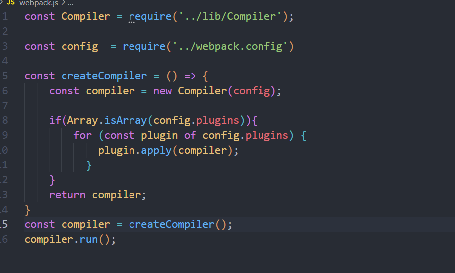
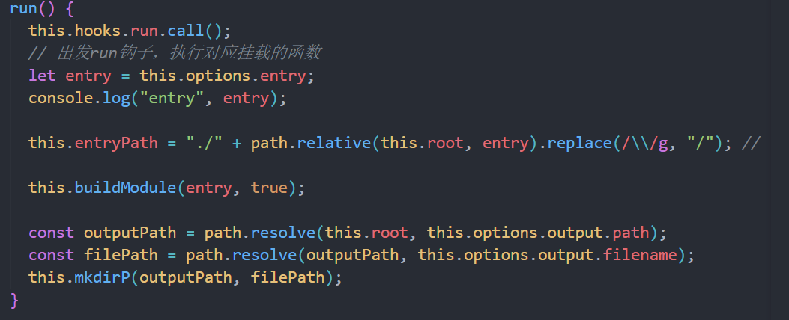
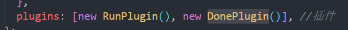
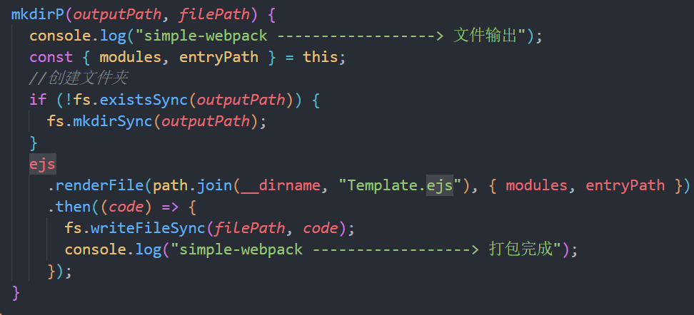

# mini-webpack

简易的 webpack


webpack 的执行流程初始化参数：从配置文件和 Shell 语句中读取与合并参数，得出最终
的参数；

开始编译：用上一步得到的参数初始化 Compiler 类，加载所有配置的插件，执行对象的
run 方法开始执行编译； 确定入口：根据配置中的 entry 找出所有的入口文件编译模块：

从入口文件出发，调用所有配置的 Loader 对模块进行编译，再找出该模块依赖的模块，再
递归本步骤直到所有入口依赖的文件都经过了本步骤的处理；

完成模块编译：在经过第 3 步使用 Loader 翻译完所有模块后，得到了每个模块被翻译后
的最终内容以及它们之间的依赖关系输出资源：

根据入口和模块之间的依赖关系，组装成一个个包含多个模块的 Chunk，再把每个 Chunk
转换成一个单独的文件加入到输出列表，这步是可以修改输出内容的最后机会输出完成：

在确定好输出内容后，根据配置确定输出的路径和文件名，把文件内容写入到文件系统

webpack 执行流程

执行 pnpm run build-> 相当于执行 node ./bin/webpack.js  这
里先实例化然后遍历插件，最后再执行**run 方法** 

这里执行 hooks 的 run 方法这里执行的是 webpack.config.js 中 plugin 中的插件


然后先得到入口文件的路径再进行构建模块 

这里解决了循环依赖的问题首先通过模块的路径拿到文件源码，再将文件源码进行一层转化

这里 parse 的作用就是：

1. 拿到 babel 转化后的 code
2. 解析依赖，拿到依赖的模块路径

把所有代码都依赖弄完之后再进行输出 

这里以 ejs 为模版，然后读取模版并且再次写入

## 实现流程

这个 mini-webpack 的工作原理是通过`Compiler`类来协调整个构建流程，从入口模块开始递归处理所有依赖模块，最终生成可执行的 bundle 文件<cite/>。

### 入口模块处理机制

入口模块的处理从`webpack.config.js`中的`entry`配置开始。当执行`compiler.run()`方法时，系统会获取入口文件路径并将其转换为相对路径格式 。

### 核心工作流程

#### 1. 初始化阶段

系统从`bin/webpack.js`启动，创建`Compiler`实例并注册插件。

```js
//webpack.js
const Compiler = require("../lib/Compiler");

const config = require("../webpack.config");

const createCompiler = () => {
  const compiler = new Compiler(config);

  if (Array.isArray(config.plugins)) {
    for (const plugin of config.plugins) {
      plugin.apply(compiler);
    }
  }
  return compiler;
};
const compiler = createCompiler();
compiler.run();
```

```js
//Compiler.js
const { SyncHook } = require("tapable");
class Compiler {
  constructor(options) {
    this.options = options;
    this.hooks = {
      initialize: new SyncHook(), // 初始化完成
      run: new SyncHook(), // 开始编译
      compile: new SyncHook(), // 开始编译模块
      buildModule: new SyncHook(["modulePath"]), // 编译单个模块
      emit: new SyncHook(), // 生成资源
      afterEmit: new SyncHook(), // 写入文件完成
      done: new SyncHook(), // 打包完成
      watchRun: new SyncHook(), //监听
      afterCompile: new SyncHook(),
    };
    this.modules = {};
    this.root = process.cwd(); // 确保 root 被正确设置

    this.extensions = this.options.resolve?.extensions || [".js", ".json"]; // 设置默认扩展名

    this.fileTimestamps = new Map(); // 记录文件修改时间，以便实现文件监听的效果
    this.watcher = null; // 文件监视器

    console.log("extensions", this.extensions);
    console.log(
      "simple-webpack ------------------> 实例化 Compiler",
      this.root
    );
    this.hooks.initialize.call(); // 触发初始化钩子
  }
}
```

这里执行初始化逻辑以及注册钩子等 其他插件在**特定时期**调用

#### 2. 模块构建流程

入口模块通过`buildModule(entry, true)`开始处理 。每个模块的处理包括：

- **路径解析**：使用`resolveModulePath()`方法处理模块路径，支持自动添加`.js`、`.json`扩展名
- **循环依赖处理**：通过标记模块状态为"processing"来避免无限递归
- **源码转换**：应用 loader 链对源码进行转换
- **AST 解析**：使用 Babel 将`require`调用转换为`__webpack_require__`并提取依赖

#### 3. 依赖递归处理

系统会递归处理每个模块的依赖 ，确保所有相关模块都被正确处理和缓存。

```js
buildModule(modulePath, isEntry) {
    // 统一处理为相对路径
    modulePath =
      "./" + path.relative(this.root, modulePath).replace(/\\/g, "/");
    // 补全文件名
    modulePath = this.resolveModulePath(modulePath);

    // 循环依赖处理：如果模块已在处理中，返回其部分导出
    if (this.modules[modulePath] === "processing") {
      // 返回一个空对象作为临时占位符
      // 返回一个空对象作为临时占位符函数
      this.modules[modulePath] =
        "(function(module, exports, __webpack_require__) { module.exports = {}; })";
      return;
    }

    if (this.modules[modulePath]) {
      return; // 解决循环依赖问题
    }

    // 标记模块为"处理中"
    this.modules[modulePath] = "processing";

    this.hooks.buildModule.call(modulePath);
    const source = this.getSource(modulePath);

    const { sourceCode, dependencies } = this.parse(source, modulePath);
    this.modules[modulePath] = sourceCode;
    console.log(
      "simple-webpack ------------------> 解析模块",
      modulePath,
      dependencies
    );

    dependencies.forEach((d) => {
      const dependencyPath = path.resolve(this.root, d);
      this.buildModule(dependencyPath, false); // 递归构建依赖
    });
  }
```

这里递归去处理依，getSource 是为了获取模块的原始内容，同时让其他 loader 起作用

#### 4. Bundle 生成

最终通过 EJS 模板系统生成可执行的 bundle 文件。生成的 bundle 包含一个模块运行时系统，提供`__webpack_require__`函数来加载和缓存模块。

```js
mkdirP(outputPath, filePath) {
  console.log("simple-webpack ------------------> 文件输出");
  const { modules, entryPath } = this;
  //创建文件夹
  if (!fs.existsSync(outputPath)) {
    fs.mkdirSync(outputPath);
  }
  this.hooks.emit.call(); // 触发 emit 钩子
  ejs
    .renderFile(path.join(__dirname, "Template.ejs"), {
      modules,
      entryPath,
      hmr: this.hmrEnabled,
    })
    .then((code) => {
      fs.writeFileSync(filePath, code);
      console.log("simple-webpack ------------------> 打包完成");
    });
}
```

这里对递归构建好的 module 进行输出，并将其转译为可执行的代码

### 模块运行时机制

生成的 bundle 使用立即执行函数模式，将所有模块作为工厂函数存储，并从入口模块开始执行 。

**Notes**

这个 mini-webpack 实现了 webpack 的核心功能，包括模块解析、依赖管理、loader 系统和插件架构。入口模块的处理是整个构建流程的起点，通过递归依赖分析确保所有相关模块都被正确处理。系统还支持热模块替换(HMR)功能，通过 WebSocket 实现开发时的实时更新。

Wiki pages you might want to explore:
