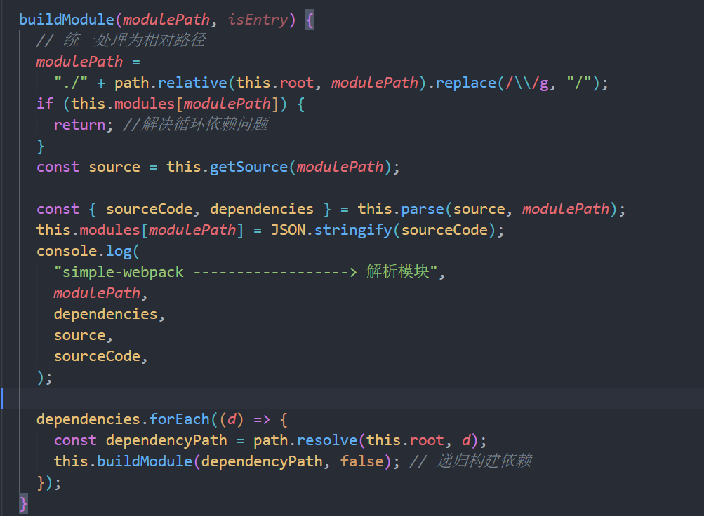

# mini-webpack

简易的 webpack

webpack 的执行流程初始化参数：从配置文件和 Shell 语句中读取与合并参数，得出最终
的参数；

开始编译：用上一步得到的参数初始化 Compiler 类，加载所有配置的插件，执行对象的
run 方法开始执行编译； 确定入口：根据配置中的 entry 找出所有的入口文件编译模块：

从入口文件出发，调用所有配置的 Loader 对模块进行编译，再找出该模块依赖的模块，再
递归本步骤直到所有入口依赖的文件都经过了本步骤的处理；

完成模块编译：在经过第 3 步使用 Loader 翻译完所有模块后，得到了每个模块被翻译后
的最终内容以及它们之间的依赖关系输出资源：

根据入口和模块之间的依赖关系，组装成一个个包含多个模块的 Chunk，再把每个 Chunk
转换成一个单独的文件加入到输出列表，这步是可以修改输出内容的最后机会输出完成：

在确定好输出内容后，根据配置确定输出的路径和文件名，把文件内容写入到文件系统

webpack 执行流程

执行 pnpm run build-> 相当于执行 node ./bin/webpack.js  这
里先实例化然后遍历插件，最后再执行**run 方法** 

这里执行 hooks 的 run 方法这里执行的是 webpack.config.js 中 plugin 中的插件

然后先得到入口文件的路径再进行构建模块 

这里解决了循环依赖的问题首先通过模块的路径拿到文件源码，再将文件源码进行一层转化

这里 parse 的作用就是：

1. 拿到 babel 转化后的 code
2. 解析依赖，拿到依赖的模块路径

把所有代码都依赖弄完之后再进行输出 

这里以 ejs 为模版，然后读取模版并且再次写入
